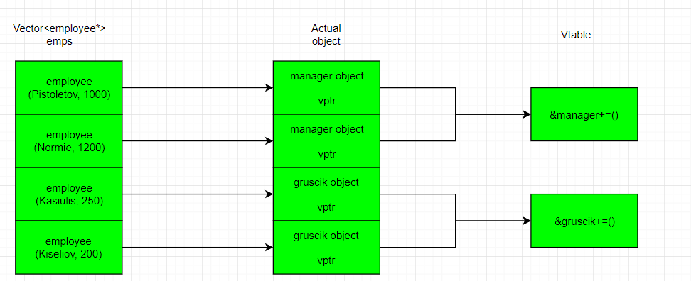

<!-- $theme: gaia -->

# Polimorfinis += operatorius


###### Mindaugas Kasiulis, ISI 1 k., 2019-05-08
---
# Užduotis

###### Įmonėje dirba dviejų tipų darbuotojai - vadybininkai ir grusčikai - žmonės su aukštuoju išsilavinimu, gaunantys mažesnį  nei minimalų atlyginimą. Reikia sukurti programą, kuri apskaičiuotų darbuotojų atlyginimus po viršvalandžių priskaičiavimo. Bazinė vieno viršvalandžio vertė - ***10 eur***, vadybininko viršvalandžio vertė - ***bazinė * 2.0***, grusčiko viršvalandžio vertė - ***bazinė * 0.25***

---
# Bazinė ```employee``` klasė
```
class employee{
protected:
    string pavarde_;
    double atlyginimas_;
    employee(string v, double a):pavarde_{v}, atlyginimas_{a}{}
public:
    virtual~employee(){printf("D-tor employee\n");}
    string  getsurname() const{
        return pavarde_;
    }
    double  getsalary() const{
        return atlyginimas_;
    }
    virtual void operator+=(int x){
        atlyginimas_+=x*10;
    }
};
```
---
# Išvestinė ```manager``` klasė
```
class manager : public employee{
public:
    ~manager() override{printf("D-tor manager\n");}
    manager(string v, double a):employee(v,a){}
    void operator+=(int x) override{
        atlyginimas_+=x*10*2.0;
    }
};
```
---
# Išvestinė ```gruscik``` klasė
```
class gruscik : public employee{
public:
    ~gruscik() override{printf("D-tor gruscik\n");}
    gruscik(string v, double a):employee(v,a){}
    void operator+=(int x) override{
        atlyginimas_+=x*10*0.25;
    }
};
```
---
# ```Overtime``` ir ```Print``` funkcijos
```
void overtime(vector<employee*>& A, int z){
    for( const auto el:A)
        *el+=z;
}
void print(vector<employee*> A){
    for( const auto el:A)
        printf("%s gaus %f europiniu\n",el->getsurname().c_str(), el->getsalary());
}
```
---
# ```Main``` funkcija

```
int main() {
    vector<employee*> emps;
    emps.push_back(new manager("Pistoletov",1000));
    emps.push_back(new manager("Normie", 1250));
    emps.push_back(new gruscik("Kasiulis",250));
    emps.push_back(new gruscik("Kiseliov",200));
    overtime(emps,2);
    print(emps);
    for(const auto el : emps)
        delete el;
    return 0;
}
```
---
# Lets get this bread
https://wandbox.org/permlink/6WE44ypxUplCX30B

---
# Vtable schema
###### Arba bent kažkas panašaus :D


---
# Bonus meme (polimorfinis + operatorius)

https://wandbox.org/permlink/aCALPTNXWOQeDVRd

---
# Fainos nuorodos 
- https://www.geeksforgeeks.org/virtual-functions-and-runtime-polymorphism-in-c-set-1-introduction/
- https://www.geeksforgeeks.org/polymorphism-in-c/
- https://stackoverflow.com/questions/11258617/c-operator-overloading-polymorphism?fbclid=IwAR0nxX5zZ--77kWChM87_Ai6gUk0jJ_s_w1nBs3i8eiFZDGttJyD9_N0ZFM

